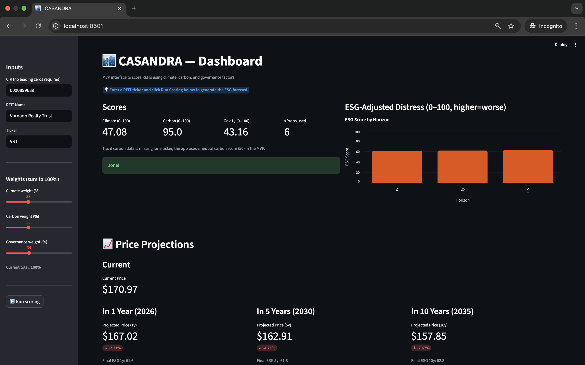

# 🏙️ Casandra — Real Estate ESG Risk Intelligence

**Casandra** is a Python-based analytics tool that combines financial, climate, and governance data to evaluate the **ESG-adjusted risk** of Real Estate Investment Trusts (REITs).  

It scrapes public filings, estimates climate and carbon exposure, analyzes governance sentiment, and generates predictive ESG distress scores across **1-, 5-, and 10-year** horizons.

It includes both a data pipeline and a Streamlit web app (app.py) for visualizing results and running analyses through an intuitive interface.

---

## 🚀 Overview

### Why
Traditional REIT analysis misses emerging ESG risks — such as carbon penalties, flood exposure, or governance controversies — that can destroy portfolio value.  
**Casandra** integrates these signals into one unified score to help investors:
- Detect early sustainability and financial risks  
- Avoid stranded or “brown” assets  
- Identify climate-resilient, well-governed REITs

### What It Does
1. **Scrapes REIT data** from SEC/EDGAR filings (Item 2 – Properties)  
2. **Geocodes property locations** and assesses **physical climate risk** (heat & flood exposure)  
3. **Estimates carbon intensity** (kg CO₂e / sqm) from sustainability disclosures  
4. **Analyzes governance sentiment** using NLP (VADER on Google News)  
5. Combines all three into an **ESG-Adjusted Distress Score (0-100)**  
6. Calculates predictive metrics for **1-, 5-, and 10-year** horizons  
7. Links ESG metrics to future **price-drop probability** (>20 % in 12 months)

---

## ⚙️ Installation

```bash
# 1. Clone the repository
git clone https://github.com/jasaka-rm/casandra.git
cd casandra

# 2. Create & activate a virtual environment
python -m venv .venv
source .venv/bin/activate   # Windows: .venv\Scripts\activate

# 3. Install dependencies
pip install -r requirements.txt
```

---

## 📸 App Preview

Below is an example of Casandra application in action.




## 🧩 Usage Example
```bash
from casandra.demo_pipeline import score_reit

result = score_reit(
    cik="0000899689",
    name="Vornado Realty Trust",
    ticker="VRT"
)

print(result)
```


Example output
```bash
{
  'climate_score': 58.4,
  'carbon_score': 35.0,
  'gov_score_1y': 52.3,
  'final_esg_1y': 48.9,
  'final_esg_5y': 47.4,
  'final_esg_10y': 46.7,
  'n_properties_used': 8,
  "current_price": 170.97,
  "adj_pct_1y": -0.16,
  "price_1y": 170.69,
  "adj_pct_5y": -0.56%,
  "price_5y": 170.02,
  "adj_pct_10y": -0.35%,
  "price_10y": 170.38,
}
```

## 🎛️ Interactive Dashboard (Streamlit)
We have built a simple Streamlit app (app.py) to visualize and interact with the Casandra model.
It lets you enter a REIT name, ticker, and CIK number, then runs the full ESG-scoring pipeline and displays results instantly in a web dashboard.

🧭 How to launch it
Make sure your virtual environment is activated and dependencies are installed:
```bash
pip install -r requirements.txt
```

Run the app:
```bash
streamlit run app.py
```

Open your browser at: 
http://localhost:8501


## 🧮 Project Structure
```bash
casandra/
│
├── __init__.py
├── carbon_intensity.py       # Compute carbon intensity score (kg CO₂e / sqm)
├── climate_risk.py           # Compute flood and heat risk (0–100 scale)
├── config.py                 # Global settings: weights, timeouts, user-agent
├── demo_pipeline.py          # Main orchestration pipeline for ESG scoring
├── edgar_scraper.py          # Scrape SEC EDGAR filings (10-K Item 2)
├── geocode.py                # Convert property addresses to lat/lon
├── governance_sentiment.py   # Analyze governance sentiment via NLP (VADER)
├── price_projection.py        # Calculate the stock-price change
├── property_parser.py        # Extract property addresses from 10-K HTML
└── scoring.py                # Combine all factors into ESG-adjusted score

# Root-level files
app.py                        # Streamlit dashboard for interactive visualization
carbon_inputs.csv             # Sample REIT carbon data
run_demo.py                   # Script to run the ESG scoring pipeline manually
requirements.txt              # Python dependencies
README.md                     # Project documentation
.venv/                        # Virtual environment (ignored in Git)
.vscode/                      # Editor configuration
static/                       # Media storage
```


## 🔜 Future Work

- Integrate scenario-based climate projections for more dynamic risk modeling.
- Implement rolling news windows to capture evolving governance sentiment.
- Scrape REIT data directly from institutional investor websites for higher accuracy.
- Calibrate carbon intensity by sector and include glide-path adjustments for planned retrofits.
- Recalculation of the score based on personalised data to guide improvements in the score.
- Normalization of the different dimensions by building type and size.